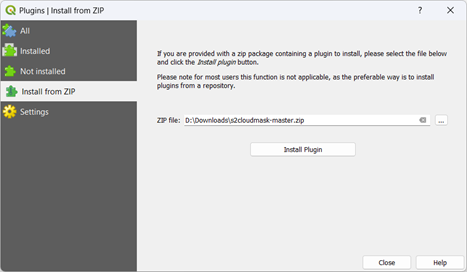

# Cloud Mask Sentinel-2 - QGIS Plugin

A QGIS plugin for cloud masking of Sentinel-2 satellite imagery using advanced machine learning algorithms.

## 🚀 Quick Start

1. **Get CDSE Account**: Register for free at [Copernicus Data Space Ecosystem](https://dataspace.copernicus.eu/)
2. **Install Plugin**: Available through QGIS Plugin Repository
3. **First Run**: Enter your CDSE credentials when prompted
4. **Start Processing**: Set your area of interest and select date range

## 📋 Requirements

- **QGIS Version**: 3.4.0-Madeira to 3.44.x-Solothurn
- **Python**: 3.7 to 3.12
- **OS**: Windows 64-bit (tested), Mac/Linux compatibility uncertain
- **Account**: Active [CDSE account](https://dataspace.copernicus.eu/) (free registration)
- **Dependencies**: ~360MB+ will be auto-installed on first use

## 📦 Installation

### Method 1: QGIS Plugin Repository (Recommended)

1. Open QGIS Desktop
2. Go to **Plugins** → **Manage and Install Plugins...**
3. Search for "**Cloud Mask Sentinel-2**"
4. Click **Install Plugin**

### Method 2: Install from ZIP

1. Download the [latest release](https://github.com/thanhgis/s2cloudmask/archive/refs/heads/master.zip)
2. **Plugins** → **Manage and Install Plugins...** → **Install from ZIP**
3. Browse and select the downloaded ZIP file
4. **Important**: Rename the installed folder to `s2cloudmask` (remove `-master` suffix)

### Method 3: Manual Installation (Advanced)

1. Download and extract the plugin
2. Copy to: `[QGIS Installation]/apps/qgis/python/plugins/`
3. Restart QGIS

## ⚡ First Time Setup

### Dependencies Installation
On first use, the plugin will automatically install required packages (~360MB):
- s2cloudless
- numpy
- cv2
- pystac_client

**Restart QGIS after installation completes.**

### CDSE Credentials Setup
Enter your Copernicus Data Space Ecosystem credentials when prompted:

> **Troubleshooting**: If you get connection errors, delete `_creds.json` from the plugin folder and re-enter credentials.

## 🎯 How to Use

### 1. Prepare Your Workspace
- Open your area of interest (AOI) in QGIS
- Set map scale to 1:25,000 or lower for Sentinel-2 scene search
- You can adjust AOI and scale later during masking

### 2. Select Date Range

**Calendar Monthly View**: Dates with available imagery are highlighted

**Custom Date Range**: Click two dates to select range

### 3. Process Images
The plugin will search, download, and process Sentinel-2 images with cloud masking applied to your selected area and timeframe.

## 📖 Documentation

**📋 [Complete User Manual](manual/QuickManual_S2CloudMask.docx)** - Download the detailed manual with full screenshots and step-by-step instructions.

## 🔧 Compatibility

- **Qt Framework**: Developed with Qt5, supports Qt6
- **QGIS Versions**: 3.4.0 (Python 3.7) through 3.44.x (Python 3.12)
- **Operating Systems**: 
  - ✅ Windows 64-bit (tested)
  - ❓ Mac/Linux (compatibility uncertain)

## 🆘 Troubleshooting

### Connection Issues
If you see CDSE connection warnings:
1. Check your internet connection
2. Verify CDSE credentials are correct
3. Delete `_creds.json` from plugin folder
4. Re-enter credentials

### Installation Issues
- Ensure you have sufficient disk space (~360MB+ for dependencies)
- Restart QGIS after dependency installation
- Check QGIS version compatibility

## 🤝 Support

- **Issues**: Report bugs on [GitHub Issues](https://github.com/thanhgis/s2cloudmask/issues)
- **Documentation**: Refer to the [detailed manual](manual/QuickManual_S2CloudMask.docx)
- **CDSE Account**: [Registration help](https://dataspace.copernicus.eu/)

## 📄 License

This plugin is open source. Check the repository for license details.

---

*For detailed step-by-step instructions with screenshots, please download the [Complete User Manual](manual/QuickManual_S2CloudMask.docx).*

## Support

For bugs/errors reporting or further discussions, feel free to email to **thanh@vnforest.org**